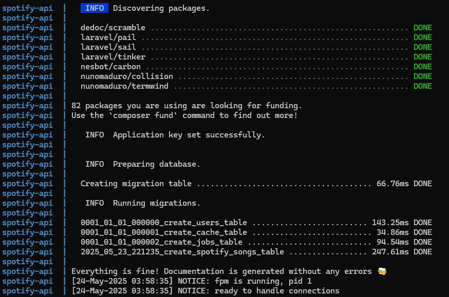

# 🌐 Inicializar el proyecto

## 1. Clonar el proyecto
   ```bash
   git clone https://github.com/palatinum/spotify-api.git
   ```

## 2. Crear el .env
   ```bash
   cd spotify-api/ && cp .env.example .env
   ```

## 3. Ejecutar docker:
   ```bash
   docker compose up
   ```
Esperar a que se ejecute las migraciones y se genere la documentación:


### La documentación
Json de la documentación: [api.json](./api.json)

Para visualizar la documentación entar en  [localhost/docs/api](http://localhost/docs/api)

Datos de ejemplo para usar la API (trackId):

- 08rBIlTMXlF5uEHobZglxv
- 0Fc9QSMX6fgEBgDjUax7t7
- 0GfS3y8Jd7SHWd9R51s7Fo
- 0r7CVbZTWZgbTCYdfa2P31
